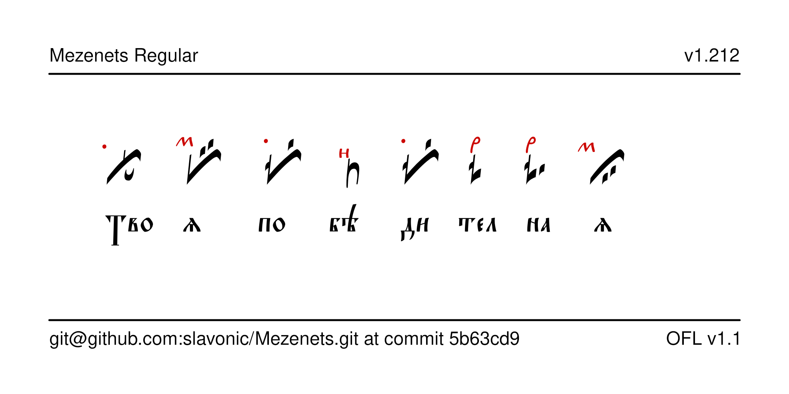

# Mezenets Typeface

Mezenets is a font for typesetting Znamenny Notation with or without priznaki.



## History

Mezenets was designed by Nikita Simmons in ... for a legacy codepage.
It was reencoded for Unicode by Aleksandr Andreev and Nikita Simmons
as part of the [proposal to add Znamenny Notation to the Unicode standard](https://www.ponomar.net/files/palaeoslavic.pdf).

## License

This Font Software is licensed under the SIL Open Font License,
Version 1.1. This license is available with a FAQ at
[https://openfontlicense.org/](https://openfontlicense.org/).

## Building the Fonts

The font is built using fontmake and gftools post processing script. Tools are all python based, so it must be previously installed.

To install all the Python tools into a virtualenv, do the following:

From terminal:

```

cd your/local/project/directory

#once in the project folder create a virtual environment. 
This step has to be done just once, the first time:

python3 -m venv venv

#activate the virtual environment

source venv/bin/activate

#install the required dependencies

pip install -r requirements.txt

```

Then run the this command:

```
cd sources
gftools builder config.yaml
```

The fonts are supposed to build automatically in the repository 
using GitHub Actions, but this does not work correctly 
for some reason.

## Features

Add this section.

There is some documentation in [PDF format](https://www.ponomar.net/files/fonts-znam.pdf).

## More Znamenny Fonts

See the [main repository](https://github.com/slavonic/fonts-znam/) and the [website](https://sci.ponomar.net/music.html).